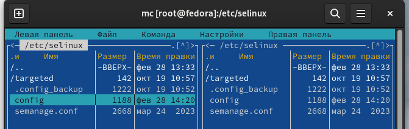
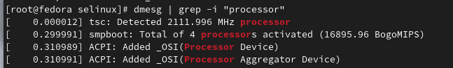

---
## Front matter
lang: ru-RU
title: "Отчет по лабораторной работе №1"
subtitle: "Операционные системы"
author: "Самарханова Полина Тимуровна, НКАбд-05-23"
institute:
  - Российский университет дружбы народов, Москва, Россия
date: 29 февраля 2024

## i18n babel
babel-lang: russian
babel-otherlangs: english

## Formatting pdf
toc: false
toc-title: Содержание
slide_level: 2
aspectratio: 169
section-titles: true
theme: metropolis
header-includes:
 - \metroset{progressbar=frametitle,sectionpage=progressbar,numbering=fraction}
 - '\makeatletter'
 - '\beamer@ignorenonframefalse'
 - '\makeatother'
---

## Цель работы

Целью данной работы является приобретение практических навыков установки операционной системы на виртуальную машину, настройки минимально необходимых для дальнейшей работы сервисов.

## Задания

1. Создание виртуальной машины
2. Установка операционной системы 
3. Работа с операционной системой после установки
4. Установка ПО для создания документации
5. Дополнительные задания

# Выполнение лабораторной работы

## Создание виртуальной машины
VirtualBox был установлен мной еще в первом семестре в курсе "Архитектура компьютера"

## Установка операционной системы
Также в первом семетре мной уже была установлена и полностью настроена Fedora 

## Работа с операционной системой после установки
Нужно отключить систему безопасности Selinux. Для этого я открыла консоль и прописала следующие команды:
sudo -s  -она нужна для того, чтобы получить права супер-пользователя
затем я перемещаюсь в директорию /etc/selinux и открываю mc 

## Работа с операционной системой после установки
В открывшемся окне нахожу и открываю файл config 

## Работа с операционной системой после установки
В этом файле нахожу строчку SELINUX=enforcing 

## Работа с операционной системой после установки
Далее меняю параметр enforcing на permissive и закрываю окно с сохранением 

## Работа с операционной системой после установки
После этого перезагружаю систему с помощью команды reboot 

## Установка ПО для создания документации
Все необходимое ПО (Pandoc, Pandoc-crossref, TexLive) было установлено еще при прохождении раздела "Архитектура компьютера"

## Домашнее задание
С помощью команды dmesg | grep -i "Linux version" ищу версию ядра Linux 

## Домашнее задание
Аналогично ищу частоту процессора, используя команду dmesg | grep -i "processor"

## Домашнее задание
Далее нахожу название модели процессора

## Домашнее задание
Потом нужно было найти объем доступной оперативной памяти, работаю аналогично

## Домашнее задание
Нахожу тип обнаруженного гипервизора, используя команду dmesg | grep -i "hypervisor"

## Домашнее задание
Тип файловой системы корневого раздела пришлось искать с помощью другой команды: df -Th | grep -i "^/dev"

## Домашнее задание
Последовательность монтирования файловых систем можно найти с помощью команды dmesg | grep -i "mounted"

## Выводы

При выполнении данной лабораторной работы я приобрела практические навыки установки операционной системы на виртуальную машину, а также сделала настройки минимально необходимых для дальнейшей работы сервисов

## Список литературы{.unnumbered}

::: {#refs}
1. Dash, P. Getting Started with Oracle VM VirtualBox / P. Dash. – Packt Publishing Ltd, 2013. – 86 сс.
2. Colvin, H. VirtualBox: An Ultimate Guide Book on Virtualization with VirtualBox. VirtualBox / H. Colvin. – CreateSpace Independent Publishing Platform, 2015. – 70 сс.
3. Vugt, S. van. Red Hat RHCSA/RHCE 7 cert guide : Red Hat Enterprise Linux 7 (EX200 and EX300) : Certification Guide. Red Hat RHCSA/RHCE 7 cert guide / S. van Vugt. – Pearson IT Certification, 2016. – 1008 сс.
4. Робачевский, А. Операционная система UNIX / А. Робачевский, С. Немнюгин, О. Стесик. – 2-е изд. – Санкт-Петербург : БХВ-Петербург, 2010. – 656 сс.
5. Немет, Э. Unix и Linux: руководство системного администратора. Unix и Linux / Э. Немет, Г. Снайдер, Т.Р. Хейн, Б. Уэйли. – 4-е изд. – Вильямс, 2014. – 1312 сс.
6. Колисниченко, Д.Н. Самоучитель системного администратора Linux : Системный администратор / Д.Н. Колисниченко. – Санкт-Петербург : БХВ-Петербург, 2011. – 544 сс.
7. Robbins, A. Bash Pocket Reference / A. Robbins. – O’Reilly Media, 2016. – 156 сс.
:::
