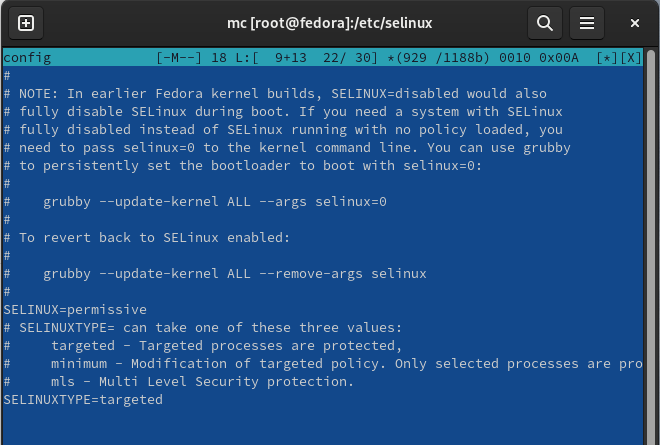
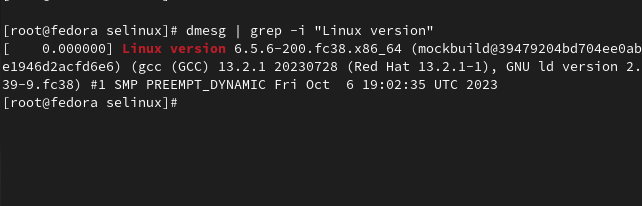
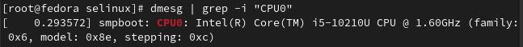
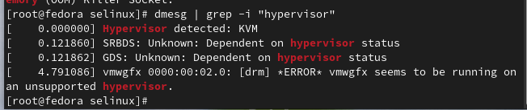
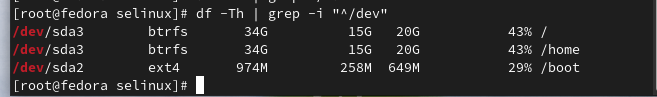
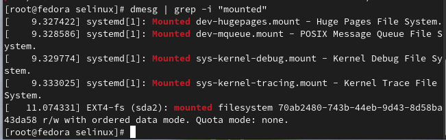

---
## Front matter
lang: ru-RU
title: "Презентация лабораторной работы №1"
subtitle: "Операционные системы"
author: 
  - "Самарханова Полина Тимуровна"
institute:
  - Российский университет дружбы народов, Москва, Россия
date: 29 февраля 2024

## i18n babel
babel-lang: russian
babel-otherlangs: english

## Formatting pdf
toc: false
toc-title: Содержание
slide_level: 2
aspectratio: 169
section-titles: true
theme: metropolis
header-includes:
 - \metroset{progressbar=frametitle,sectionpage=progressbar,numbering=fraction}
 - '\makeatletter'
 - '\beamer@ignorenonframefalse'
 - '\makeatother'
---

# Презентация лабораторной работы №1

## Докладчик

Самарханова Полина Тимуровна
https://github.com/PolinaSamarkhanova

# Цель работы

Целью данной работы является приобретение практических навыков установки операционной системы на виртуальную машину, настройки минимально необходимых для дальнейшей работы сервисов.

# Задания

1. Создание виртуальной машины
2. Установка операционной системы 
3. Работа с операционной системой после установки
4. Установка ПО для создания документации
5. Дополнительные задания

# Выполнение лабораторной работы

# Создание виртуальной машины
VirtualBox был установлен мной еще в первом семестре в курсе "Архитектура компьютера"

# Установка операционной системы
Также в первом семетре мной уже была установлена и полностью настроена Fedora 

# Работа с операционной системой после установки

## Нужно отключить систему безопасности Selinux. 
Для этого я открыла консоль и прописала следующие команды: sudo -s  -она нужна для того, чтобы получить права супер-пользователя
затем я перемещаюсь в директорию /etc/selinux и открываю mc 

## В открывшемся окне нахожу и открываю файл config (рис. 3.2)

## В этом файле нахожу строчку SELINUX=enforcing (рис. 3.3)

## Далее меняю параметр enforcing на permissive и закрываю окно с сохранением (рис. 3.4)

## После этого перезагружаю систему с помощью команды reboot (рис. 3.5)

# Установка ПО для создания документации
Все необходимое ПО (Pandoc, Pandoc-crossref, TexLive) было установлено еще при прохождении раздела "Архитектура компьютера"

# Домашнее задание
Нужно получить следующую иинформацию о системе и конфигурации компьютера:

## С помощью команды dmesg | grep -i "Linux version" ищу версию ядра Linux 

## Аналогично ищу частоту процессора, используя команду dmesg | grep -i "processor"

## Далее нахожу название модели процессора

## Потом нужно было найти объем доступной оперативной памяти, работаю аналогично

 

## Нахожу тип обнаруженного гипервизора, используя команду dmesg | grep -i "hypervisor"

 

## Тип файловой системы корневого раздела пришлось искать с помощью другой команды: df -Th | grep -i "^/dev"

## Последовательность монтирования файловых систем можно найти с помощью команды dmesg | grep -i "mounted"

# Ответы на контрольные вопросы

1. Учетная запись содержит необходимые для идентификации пользователя при подключении к системе данные, а так же информацию для авторизации и учета: системного имени (user name) (оно может содержать только латинские буквы и знак нижнее подчеркивание, еще оно должно быть уникальным), идентификатор пользователя (UID) (уникальный идентификатор пользователя в системе, целое положительное число), идентификатор группы (CID) (группа, к к-рой относится пользователь. Она, как минимум, одна, по умолчанию - одна), полное имя (full name) (Могут быть ФИО), домашний каталог (home directory) (каталог, в к-рый попадает пользователь после входа в систему и в к-ром хранятся его данные), начальная оболочка (login shell) (командная оболочка, к-рая запускается при входе в систему).

2. Для получения справки по команде: <команда> --help; для перемещения по файловой системе - cd; для просмотра содержимого каталога - ls; для определения объёма каталога - du <имя каталога>; для создания / удаления каталогов - mkdir/rmdir; для создания / удаления файлов - touch/rm; для задания определённых прав на файл / каталог - chmod; для просмотра истории команд - history

3. Файловая система - это порядок, определяющий способ организации и хранения и именования данных на различных носителях информации. Примеры: FAT32 представляет собой пространство, разделенное на три части: олна область для служебных структур, форма указателей в виде таблиц и зона для хранения самих файлов. ext3/ext4 - журналируемая файловая система, используемая в основном в ОС с ядром Linux.

4. С помощью команды df, введя ее в терминале. Это утилита, которая показывает список всех файловых систем по именам устройств, сообщает их размер и данные о памяти. Также посмотреть подмонтированные файловые системы можно с помощью утилиты mount.

5. Чтобы удалить зависший процесс, вначале мы должны узнать, какой у него id: используем команду ps. Далее в терминале вводим команду kill < id процесса >. Или можно использовать утилиту killall, что "убьет" все процессы, которые есть в данный момент, для этого не нужно знать id процесса.

# Выводы

При выполнении данной лабораторной работы я приобрела практические навыки установки операционной системы на виртуальную машину, а также сделала настройки минимально необходимых для дальнейшей работы сервисов
:::

