---
## Front matter
title: "Отчет по лабораторной работе №1"
subtitle: "Операционные системы"
author: "Самарханова Полина Тимуровна"

## Generic otions
lang: ru-RU
toc-title: "Содержание"

## Bibliography
bibliography: bib/cite.bib
csl: pandoc/csl/gost-r-7-0-5-2008-numeric.csl

## Pdf output format
toc: true # Table of contents
toc-depth: 2
lof: true # List of figures
lot: true # List of tables
fontsize: 12pt
linestretch: 1.5
papersize: a4
documentclass: scrreprt
## I18n polyglossia
polyglossia-lang:
  name: russian
  options:
	- spelling=modern
	- babelshorthands=true
polyglossia-otherlangs:
  name: english
## I18n babel
babel-lang: russian
babel-otherlangs: english
## Fonts
mainfont: PT Serif
romanfont: PT Serif
sansfont: PT Sans
monofont: PT Mono
mainfontoptions: Ligatures=TeX
romanfontoptions: Ligatures=TeX
sansfontoptions: Ligatures=TeX,Scale=MatchLowercase
monofontoptions: Scale=MatchLowercase,Scale=0.9
## Biblatex
biblatex: true
biblio-style: "gost-numeric"
biblatexoptions:
  - parentracker=true
  - backend=biber
  - hyperref=auto
  - language=auto
  - autolang=other*
  - citestyle=gost-numeric
## Pandoc-crossref LaTeX customization
figureTitle: "Рис."
tableTitle: "Таблица"
listingTitle: "Листинг"
lofTitle: "Список иллюстраций"
lotTitle: "Список таблиц"
lolTitle: "Листинги"
## Misc options
indent: true
header-includes:
  - \usepackage{indentfirst}
  - \usepackage{float} # keep figures where there are in the text
  - \floatplacement{figure}{H} # keep figures where there are in the text
---

# Цель работы

Целью данной работы является приобретение практических навыков установки операционной системы на виртуальную машину, настройки минимально необходимых для дальнейшей работы сервисов.

# Задания

1. Создание виртуальной машины
2. Установка операционной системы 
3. Работа с операционной системой после установки
4. Установка ПО для создания документации
5. Дополнительные задания

# Выполнение лабораторной работы

## Создание виртуальной машины
VirtualBox был установлен мной еще в первом семестре в курсе "Архитектура компьютера"

## Установка операционной системы
Также в первом семетре мной уже была установлена и полностью настроена Fedora 

## Работа с операционной системой после установки
Все настройки были проведены и удовлетворют требованиям лабораторной работы, за исключением одной: нужно было отключить систему безопасности Selinux. Для этого я открыла консоль и прописала следующие команды:
sudo -s  -она нужна для того, чтобы получить права супер-пользователя
затем я перемещаюсь в директорию /etc/selinux и открываю mc (рис. 3.1)

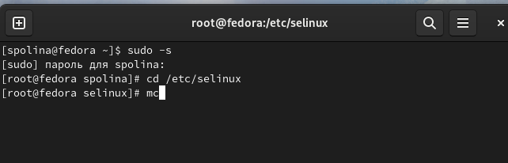{ #fig:001 width=70% }

В открывшемся окне нахожу и открываю файл config (рис. 3.2)

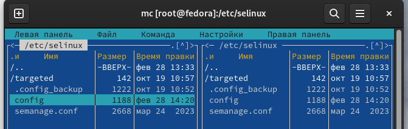{ #fig:002 width=70% }

В этом файле нахожу строчку SELINUX=enforcing (рис. 3.3)

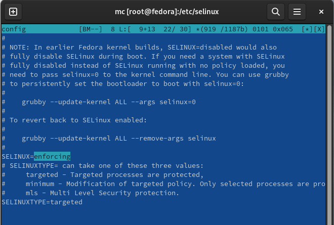{ #fig:003 width=70% }

Далее меняю параметр enforcing на permissive и закрываю окно с сохранением (рис. 3.4)

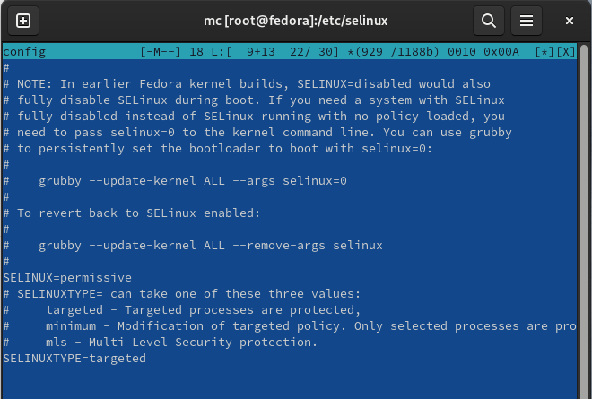{ #fig:004 width=70% }

После этого перезагружаю систему с помощью команды reboot (рис. 3.5)

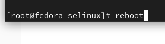{ #fig:005 width=70% }

## Установка ПО для создания документации
Все необходимое ПО (Pandoc, Pandoc-crossref, TexLive) было установлено еще при прохождении раздела "Архитектура компьютера"

#Домашние задания
С помощью данной команды dmesg | grep -i "то, что ищем" нужно было получить следующую иинформацию о системе и конфигурации компьютера:
Версия ядра Linux (Linux version).
Частота процессора (Detected Mhz processor).
Модель процессора (CPU0).
Объём доступной оперативной памяти (Memory available).
Тип обнаруженного гипервизора (Hypervisor detected).
Тип файловой системы корневого раздела.
Последовательность монтирования файловых систем.

С помощью команды dmesg | grep -i "Linux version" ищу версию ядра Linux 

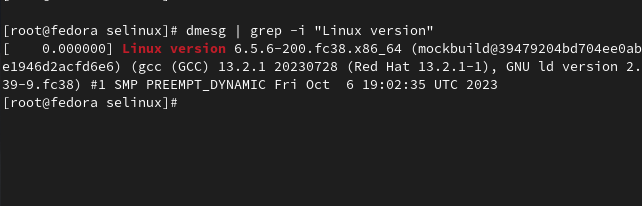{ #fig:006 width=70% }

Аналогично ищу частоту процессора, используя команду dmesg | grep -i "processor"

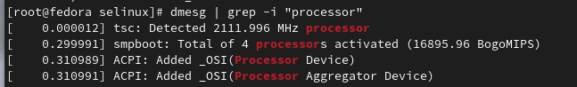{ #fig:007 width=70% }

Далее нахожу название модели процессора

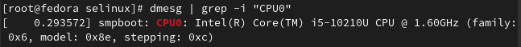{ #fig:008 width=70% }

Потом нужно было найти объем доступной оперативной памяти, работаю аналогично

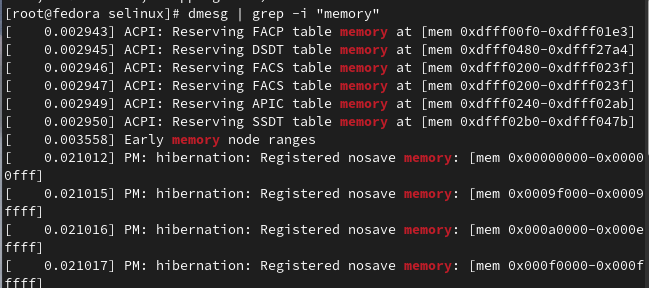{ #fig:009 width=70% }

Нахожу тип обнаруженного гипервизора, используя команду dmesg | grep -i "hypervisor"

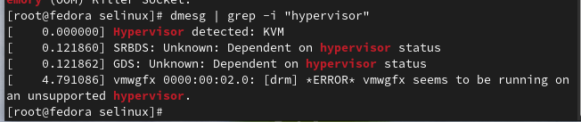{ #fig:010 width=70% }

Тип файловой системы корневого раздела пришлось искать с помощью другой команды: df -Th | grep -i "^/dev"

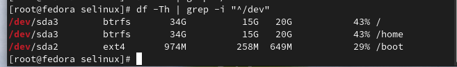{ #fig:011 width=70% }

Последовательность монтирования файловых систем можно найти с помощью команды dmesg | grep -i "mounted"

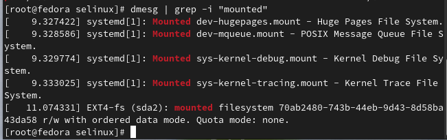{ #fig:012 width=70% }

# Выводы

При выполнении данной лабораторной работы я приобрела практические навыки установки операционной системы на виртуальную машину, а также сделала настройки минимально необходимых для дальнейшей работы сервисов

# Ответы на контрольные вопросы

1. Учетная запись содержит необходимые для идентификации пользователя при подключении к системе данные, а так же информацию для авторизации и учета: системного имени (user name) (оно может содержать только латинские буквы и знак нижнее подчеркивание, еще оно должно быть уникальным), идентификатор пользователя (UID) (уникальный идентификатор пользователя в системе, целое положительное число), идентификатор группы (CID) (группа, к к-рой относится пользователь. Она, как минимум, одна, по умолчанию - одна), полное имя (full name) (Могут быть ФИО), домашний каталог (home directory) (каталог, в к-рый попадает пользователь после входа в систему и в к-ром хранятся его данные), начальная оболочка (login shell) (командная оболочка, к-рая запускается при входе в систему).

2. Для получения справки по команде: <команда> --help; для перемещения по файловой системе - cd; для просмотра содержимого каталога - ls; для определения объёма каталога - du <имя каталога>; для создания / удаления каталогов - mkdir/rmdir; для создания / удаления файлов - touch/rm; для задания определённых прав на файл / каталог - chmod; для просмотра истории команд - history

3. Файловая система - это порядок, определяющий способ организации и хранения и именования данных на различных носителях информации. Примеры: FAT32 представляет собой пространство, разделенное на три части: олна область для служебных структур, форма указателей в виде таблиц и зона для хранения самих файлов. ext3/ext4 - журналируемая файловая система, используемая в основном в ОС с ядром Linux.

4. С помощью команды df, введя ее в терминале. Это утилита, которая показывает список всех файловых систем по именам устройств, сообщает их размер и данные о памяти. Также посмотреть подмонтированные файловые системы можно с помощью утилиты mount.

5. Чтобы удалить зависший процесс, вначале мы должны узнать, какой у него id: используем команду ps. Далее в терминале вводим команду kill < id процесса >. Или можно использовать утилиту killall, что "убьет" все процессы, которые есть в данный момент, для этого не нужно знать id процесса.

# Список литературы{.unnumbered}

::: {#refs}
1. Dash, P. Getting Started with Oracle VM VirtualBox / P. Dash. – Packt Publishing Ltd, 2013. – 86 сс.
2. Colvin, H. VirtualBox: An Ultimate Guide Book on Virtualization with VirtualBox. VirtualBox / H. Colvin. – CreateSpace Independent Publishing Platform, 2015. – 70 сс.
3. Vugt, S. van. Red Hat RHCSA/RHCE 7 cert guide : Red Hat Enterprise Linux 7 (EX200 and EX300) : Certification Guide. Red Hat RHCSA/RHCE 7 cert guide / S. van Vugt. – Pearson IT Certification, 2016. – 1008 сс.
4. Робачевский, А. Операционная система UNIX / А. Робачевский, С. Немнюгин, О. Стесик. – 2-е изд. – Санкт-Петербург : БХВ-Петербург, 2010. – 656 сс.
5. Немет, Э. Unix и Linux: руководство системного администратора. Unix и Linux / Э. Немет, Г. Снайдер, Т.Р. Хейн, Б. Уэйли. – 4-е изд. – Вильямс, 2014. – 1312 сс.
6. Колисниченко, Д.Н. Самоучитель системного администратора Linux : Системный администратор / Д.Н. Колисниченко. – Санкт-Петербург : БХВ-Петербург, 2011. – 544 сс.
7. Robbins, A. Bash Pocket Reference / A. Robbins. – O’Reilly Media, 2016. – 156 сс.
:::
