---
## Front matter
lang: ru-RU
title: "Отчет по лабораторной работе №2"
subtitle: "Операционные системы"
author: "Самарханова П.Т. НКАбд-05-23"
institute:
  - Российский университет дружбы народов, Москва, Россия
date: 29 февраля 2024

## i18n babel
babel-lang: russian
babel-otherlangs: english

## Formatting pdf
toc: false
toc-title: Содержание
slide_level: 2
aspectratio: 169
section-titles: true
theme: metropolis
header-includes:
 - \metroset{progressbar=frametitle,sectionpage=progressbar,numbering=fraction}
 - '\makeatletter'
 - '\beamer@ignorenonframefalse'
 - '\makeatother'
---

## Цель работы

Целью данной работы является изучение идеологии и применения средств контроля версий, а также освоение умений по работе с git.

## Задания

1. Создание базовой конфигурации для работы с git
2. Создание SSH ключа
3. Создание GPG ключа
4. Настройка подписей git
5. Регистрация на Github
6. Создание локального каталога для выполнения заданий по предмету

# Выполнение лабораторной работы

## Установка ПО
Устанавливаю необходимое ПО git и gh через терминал с помощью команд dnf install git, dnf install gh

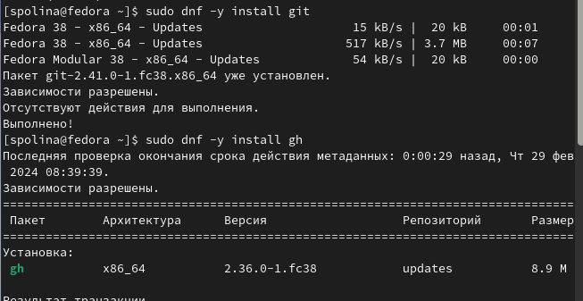

## Базовая настройка git
Задаю в качестве имени и почты владельца свои имя с фамилией и почту соответственно

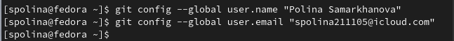

## Базовая настройка git
Настраиваю utf-8 в выводе сообщений git для их корректного отображения

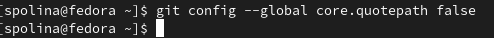

## Базовая настройка git
Начальной ветке задаю имя master

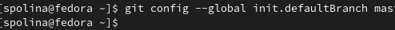

## Базовая настройка git
Задаю параметры autocrlf и safecrlf для корректного отображения конца строки

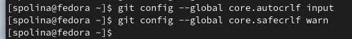

## Создание ключа SSH
Создаю ключ SSH размером 4096 бит по алгоритму rsa

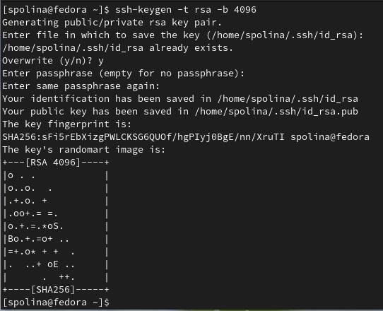

## Создание ключа SSH
Создаю ключ SSH по алгоритму ed25519

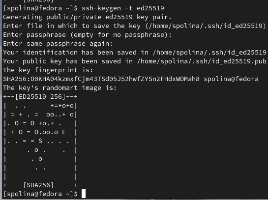

## Создание ключа GPG
Генерирую ключ GPG, затем выбираю тип ключа RSA и RSA, длина ключа 4096 бит, срок действия - неограниченный. Затем отвечаю на запрашиваемую личную информацию

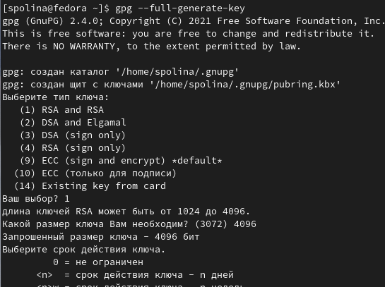

## Создание ключа GPG
Аккаунт у меня уже был, поэтому просто вхожу в него

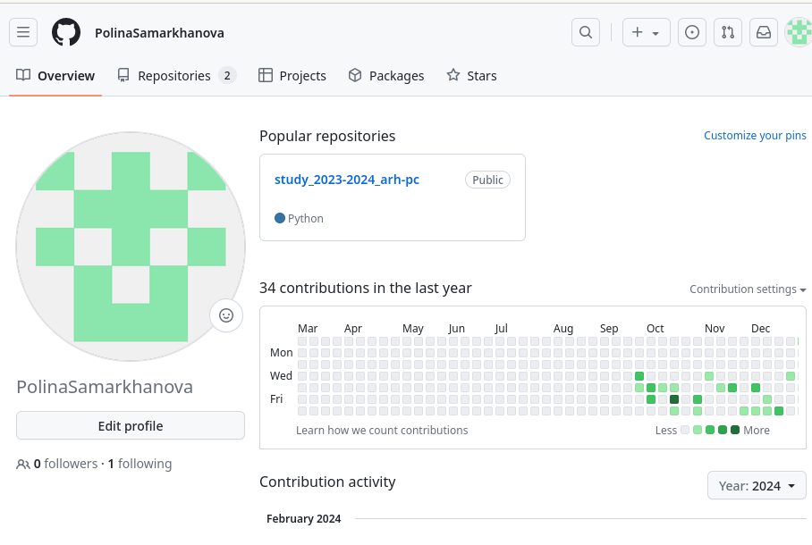

## Добавление ключа GPG в Github
Выводим список ключей и копируем в буфер обмена отпечаток приватного ключа 

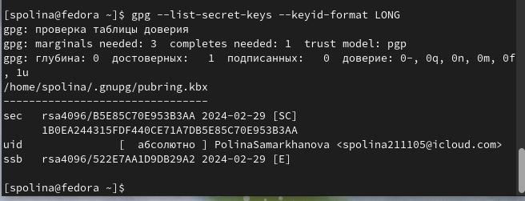

## Добавление ключа GPG в Github
Копирую сам ключ в буфер обмена

## Добавление ключа GPG в Github
Далее открываю настройки Github и ищу раздел GPG ключей

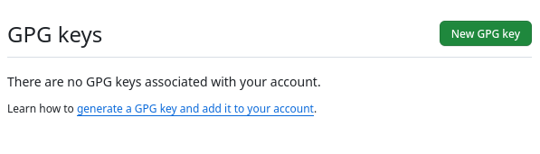

## Добавление ключа GPG в Github
Нажимаю кнопку New GPG keyи вставляю в нужное поле скопированный ключ

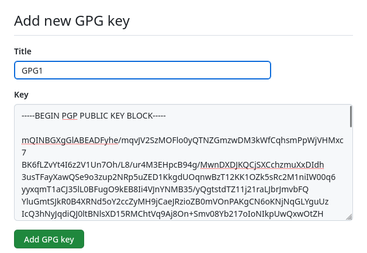

## Добавление ключа GPG в Github
Теперь можно увидеть добавленный на Github ключ GPG

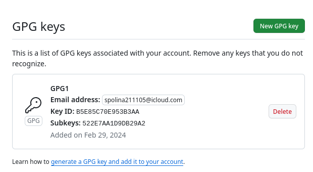

## Добавление ключа GPG в Github
Далее настраиваю автоматические подписи коммитов Git 

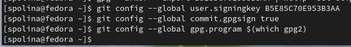

## Настройка gh
Начинаю с авторизации в gh: нужно было ответить на вопросы утилиты и в конце выбрать авторизацию через браузер. 

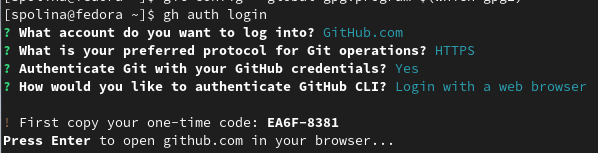

## Настройка gh
Скопировав 8-значный код и вставив его в открывшемся окне браузера, завершаю авторизацию

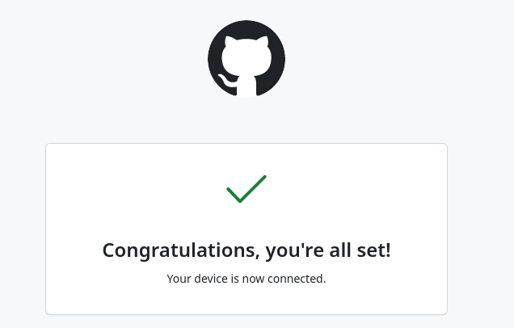

## Сознание репозитория курса на основе шаблона
Теперь можно увидеть завершение авторизации и в терминале

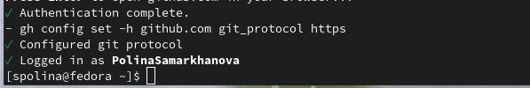

## Сознание репозитория курса на основе шаблона
Создаю каталог Операционные системы, перехожу в него, создаю репозиторий по шаблону и копирую его в созданный каталог

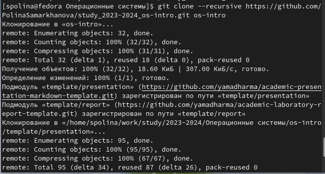

## Сознание репозитория курса на основе шаблона
Перехожу в каталог курса с помощью утилиты cd, затем с помощью ls проверяю содержимое каталога

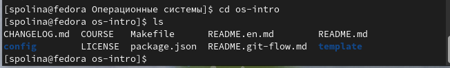

## Сознание репозитория курса на основе шаблона
Удаляю лишние файлы с помощью команды rm, затем создаю необходимые каталоги, используя makefile

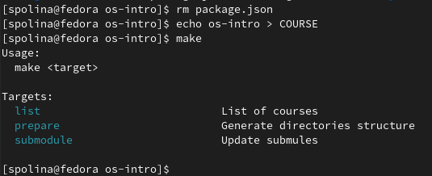

## Сознание репозитория курса на основе шаблона
Добавляю все новые файлы для отправки на сервер с помощью git add и комментирую при помощи git commit

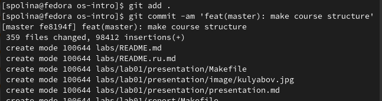

## Сознание репозитория курса на основе шаблона
Отправляю файлы на сервер с помощью git push

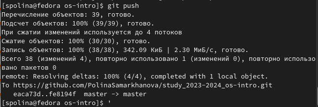

## Выводы
При выполнении данной лабораторной работы я идеологию и применение средств контроля версий, а также освоила навыки по работе с git

#Спасибо за внимание

