---
## Front matter
title: "Отчет по лабораторной работе №2"
subtitle: "Операционные системы"
author: "Самарханова Полина Тимуровна"

## Generic otions
lang: ru-RU
toc-title: "Содержание"

## Bibliography
bibliography: bib/cite.bib
csl: pandoc/csl/gost-r-7-0-5-2008-numeric.csl

## Pdf output format
toc: true # Table of contents
toc-depth: 2
lof: true # List of figures
lot: true # List of tables
fontsize: 12pt
linestretch: 1.5
papersize: a4
documentclass: scrreprt
## I18n polyglossia
polyglossia-lang:
  name: russian
  options:
	- spelling=modern
	- babelshorthands=true
polyglossia-otherlangs:
  name: english
## I18n babel
babel-lang: russian
babel-otherlangs: english
## Fonts
mainfont: PT Serif
romanfont: PT Serif
sansfont: PT Sans
monofont: PT Mono
mainfontoptions: Ligatures=TeX
romanfontoptions: Ligatures=TeX
sansfontoptions: Ligatures=TeX,Scale=MatchLowercase
monofontoptions: Scale=MatchLowercase,Scale=0.9
## Biblatex
biblatex: true
biblio-style: "gost-numeric"
biblatexoptions:
  - parentracker=true
  - backend=biber
  - hyperref=auto
  - language=auto
  - autolang=other*
  - citestyle=gost-numeric
## Pandoc-crossref LaTeX customization
figureTitle: "Рис."
tableTitle: "Таблица"
listingTitle: "Листинг"
lofTitle: "Список иллюстраций"
lotTitle: "Список таблиц"
lolTitle: "Листинги"
## Misc options
indent: true
header-includes:
  - \usepackage{indentfirst}
  - \usepackage{float} # keep figures where there are in the text
  - \floatplacement{figure}{H} # keep figures where there are in the text
---

# Цель работы

Целью данной работы является изучение идеологии и применения средств контроля версий, а также освоение умений по работе с git.

# Задания

1. Создание базовой конфигурации для работы с git
2. Создание SSH ключа
3. Создание GPG ключа
4. Настройка подписей git
5. Регистрация на Github
6. Создание локального каталога для выполнения заданий по предмету

# Выполнение лабораторной работы

## Установка ПО
Устанавливаю необходимое ПО git и gh через терминал с помощью команд dnf install git, dnf install gh

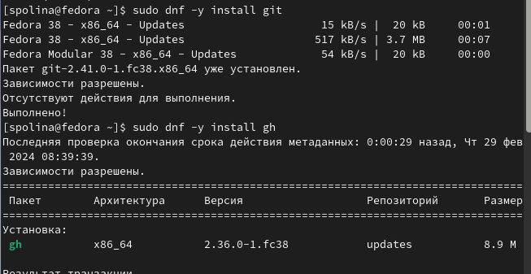{ #fig:001 width=70% }

## Базовая настройка git
Задаю в качестве имени и почты владельца свои имя с фамилией и почту соответственно

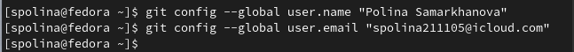{ #fig:002 width=70% }

Настраиваю utf-8 в выводе сообщений git для их корректного отображения

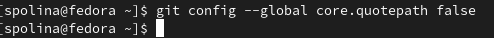{ #fig:003 width=70% }

Начальной ветке задаю имя master

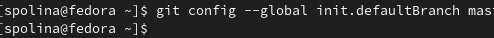{ #fig:004 width=70% }

Задаю параметры autocrlf и safecrlf для корректного отображения конца строки

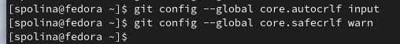{ #fig:005 width=70% }

## Создание ключа SSH

Создаю ключ SSH размером 4096 бит по алгоритму rsa

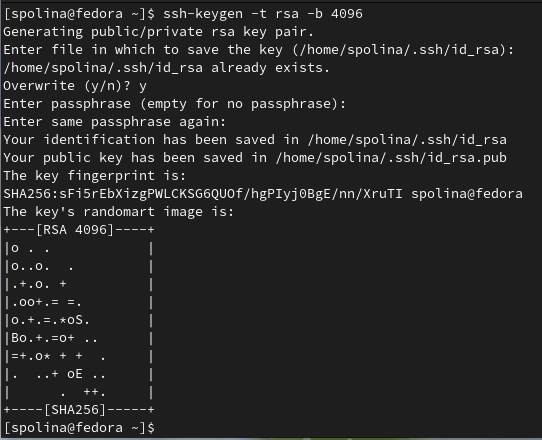{ #fig:006 width=70% }

Создаю ключ SSH по алгоритму ed25519

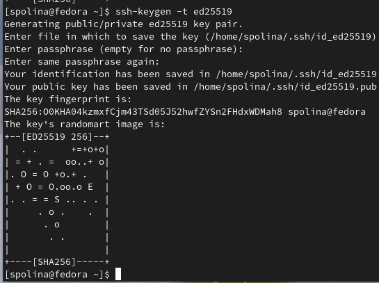{ #fig:007 width=70% }

## Создание ключа GPG

Генерирую ключ GPG, затем выбираю тип ключа RSA и RSA, длина ключа 4096 бит, срок действия - неограниченный. Затем отвечаю на запрашиваемую личную информацию

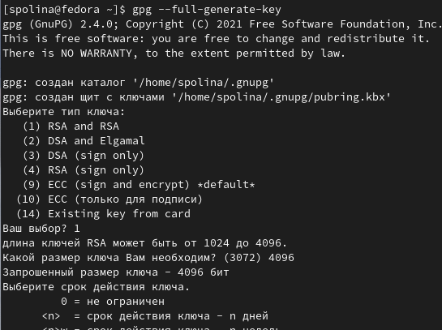{ #fig:008 width=70% }

## Регистрация на GitHub

Аккаунт у меня уже был, поэтому просто вхожу в него

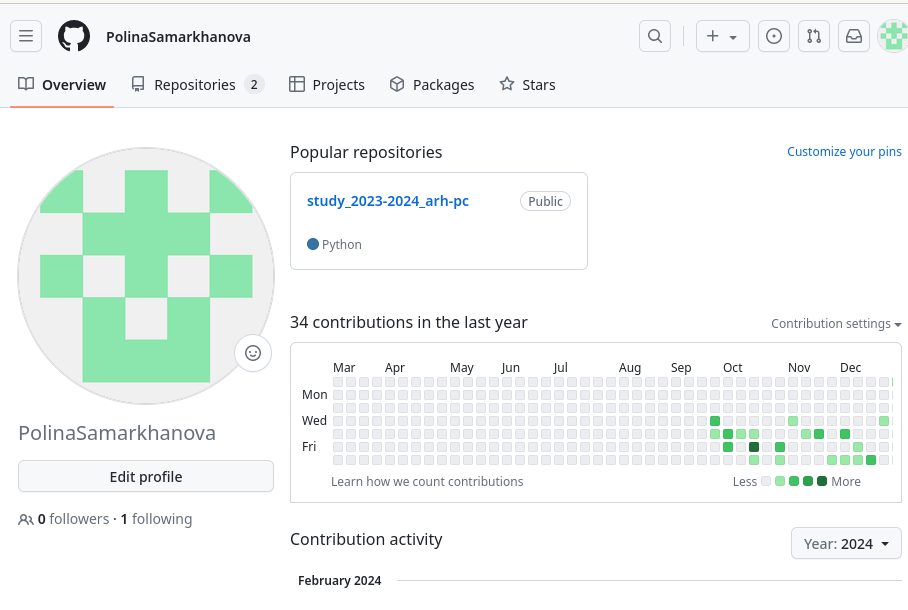{ #fig:009 width=70% }

## Добавление ключа GPG в Github

Выводим список ключей и копируем в буфер обмена отпечаток приватного ключа (последовательность байтов, используемая для идентификации более длинного, по сравнению с самим отпечатком ключа), который находится после знака слеша

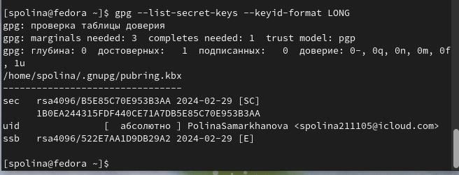{ #fig:010 width=70% }

Ввожу в терминале команду gpg --armor --export <КЛЮЧ> | xclip -sel clip 
С ее помощью копирую сам ключ в буфер обмена

{ #fig:011 width=70% }

Далее открываю настройки Github и ищу раздел GPG ключей

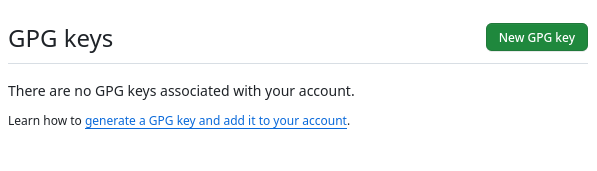{ #fig:012 width=70% }

Нажимаю кнопку New GPG keyи вставляю в нужное поле скопированный ключ

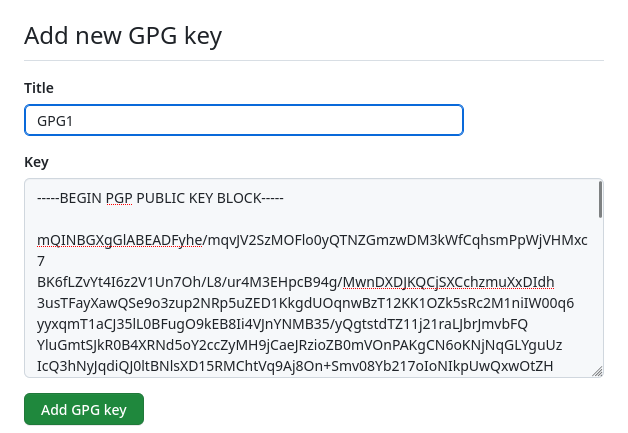{ #fig:014 width=70% }

Теперь можно увидеть добавленный на Github ключ GPG

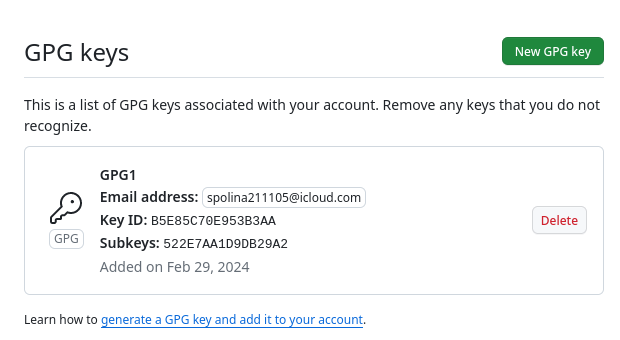{ #fig:014 width=70% }

Далее настраиваю автоматические подписи коммитов Git 

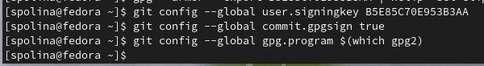{ #fig:015 width=70% }

## Настройка gh

Начинаю с авторизации в gh: нужно было ответить на вопросы утилиты и в конце выбрать авторизацию через браузер. 

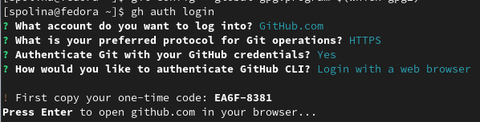{ #fig:016 width=70% }

Скопировав 8-значный код и вставив его в открывшемся окне браузера, завершаю авторизацию

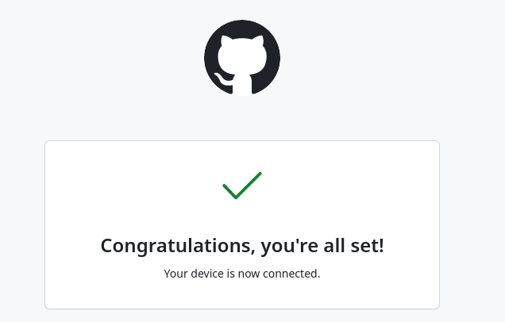{ #fig:017 width=70% }

Теперь можно увидеть завершение авторизации и в терминале

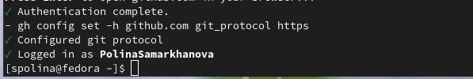{ #fig:018 width=70% }

## Сознание репозитория курса на основе шаблона

Сначала я создала новую папку с помощью утилиты mkdir:  mkdir -p ~/work/study/2023-2024/"Операционные системы"
Далее я перешла в саму папку Операционные системы через утилиту cd
Затем я в терминале ввела команду: gh repo create study_2023-2024_os-intro --template=yamadharma/course-directory-student-template --public
Она нужна для того, чтобы создать репозиторий на основе указанного шаблона
после этого я клонировала репозиторий к себе в папку, но указала ссылку с протоколом hhtps, а не ssh

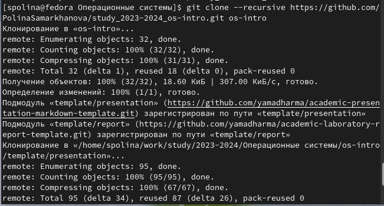{ #fig:019 width=70% }

Перехожу в каталог курса с помощью утилиты cd, затем с помощью ls проверяю содержимое каталога

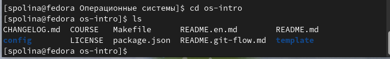{ #fig:020 width=70% }

Удаляю лишние файлы с помощью команды rm, затем создаю необходимые каталоги, используя makefile, а именно:
make list
make prepare
make submodule

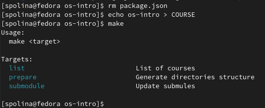{ #fig:021 width=70% }

Добавляю все новые файлы для отправки на сервер с помощью git add и комментирую при помощи git commit

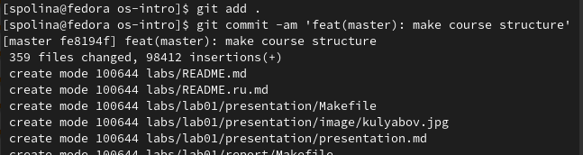{ #fig:022 width=70% }

Отправляю файлы на сервер с помощью git push

{ #fig:023 width=70% }

# Выводы

При выполнении данной лабораторной работы я идеологию и применение средств контроля версий, а также освоила навыки по работе с git

# Ответы на контрольные вопросы

1. Системы контроля версий (VCS) - программное обеспечение для облегчения работы с изменяющейся информацией. 
Они позволяют хранить несколько версий изменяющейся информации, 
одного и того же документа, может предоставить доступ к более ранним версиям документа. 
Используется для работы нескольких человек над проектом, позволяет посмотреть, кто и 
когда внес какое-либо изменение и т. д. VCS ррименяются для: Хранения понлой истории изменений, 
сохранения причин всех изменений, поиска причин изменений и совершивших изменение, совместной работы над проектами.

2. Хранилище -- репозиторий, хранилище версий, в нем хранятся все документы, включая историю их изменения и прочей служебной информацией. 
commit -- отслеживание изменений, сохраняет разницу в изменениях.
История -- хранит все изменения в проекте и позволяет при необходимости вернуться/обратиться к нужным данным.
Рабочая копия -- копия проекта, основанная на версии из хранилища, чаще всего последней версии.

3. Централизованные VCS (например: CVS, TFS, AccuRev) -- одно основное хранилище всего проекта. Каждый пользователь копирует себе
необходимые ему файлы из этого репозитория, изменяет, затем добавляет изменения обратно в хранилище. Децентрализованные
VCS (например: Git, Bazaar) -- у каждого пользователя свой вариант репозитория (возможно несколько вариантов), есть возможность добавлять
и забирать изменения из любого репозитория. В отличие от классических, в распределенных (децентралиованных)
системах контроля версий центральный репозиторий не является обязательным.

4. Сначала создается и подключается удаленный репозиторий, затем по мере изменения проекта эти изменения отправляются на сервер.

5. Участник проекта перед началом работы получает нужную ему версию проекта в хранилище, с помощью определенных команд, после внесения изменений пользователь размещает новую версию в хранилище. При этом предыдущие версии не удаляются. К ним можно вернуться в любой момент.

6. Хранение информации о всех изменениях в вашем коде, обеспечение удобства командной работы над кодом.

7. Создание основного дерева репозитория: git init

Получение обновлений (изменений) текущего дерева из центрального репозитория: git pull

Отправка всех произведённых изменений локального дерева в центральный репозиторий: git push

Просмотр списка изменённых файлов в текущей директории: git status

Просмотр текущих изменений: git diff

Сохранение текущих изменений: добавить все изменённые и/или созданные файлы и/или каталоги: git add .

добавить конкретные изменённые и/или созданные файлы и/или каталоги: git add имена_файлов

удалить файл и/или каталог из индекса репозитория (при этом файл и/или каталог остаётся в локальной директории): git rm имена_файлов

Сохранение добавленных изменений:

сохранить все добавленные изменения и все изменённые файлы: git commit -am 'Описание коммита'

сохранить добавленные изменения с внесением комментария через встроенный редактор: git commit

создание новой ветки, базирующейся на текущей: git checkout -b имя_ветки

переключение на некоторую ветку: git checkout имя_ветки (при переключении на ветку, которой ещё нет в локальном репозитории, она будет создана и связана с удалённой)

отправка изменений конкретной ветки в центральный репозиторий: git push origin имя_ветки

слияние ветки с текущим деревом: git merge --no-ff имя_ветки

Удаление ветки:

удаление локальной уже слитой с основным деревом ветки: git branch -d имя_ветки

принудительное удаление локальной ветки: git branch -D имя_ветки

удаление ветки с центрального репозитория: git push origin :имя_ветки

8. git push -all отправляем из локального репозитория все сохраненные изменения в центральный репозиторий, предварительно создав локальный репозиторий и сделав предварительную конфигурацию.

9. Ветвление - один из параллельных участков в одном хранилище, исходящих из одной версии, обычно есть главная ветка. 
Между ветками, т. е. их концами возможно их слияние. Используются для разработки новых функций.

10. Во время работы над проектом могут создаваться файлы, которые не следуют добавлять в репозиторий. Например, временные файлы.
Можно прописать шаблоны игнорируемых при добавлении в репозиторий типов файлов в файл .gitignore с помощью сервисов.

# Список литературы{.unnumbered}

::: {#refs}
1. Лабораторная работа №2 (электронный ресурс) URL:https://esystem.rudn.ru/mod/page/view.php?id=1098790
:::
