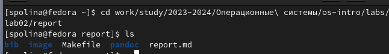
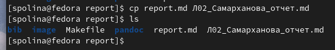
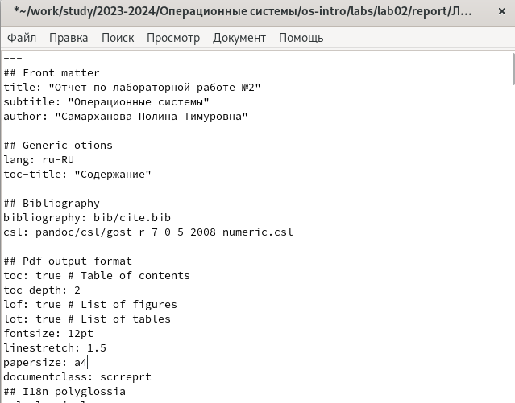
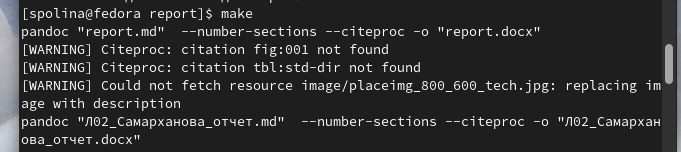
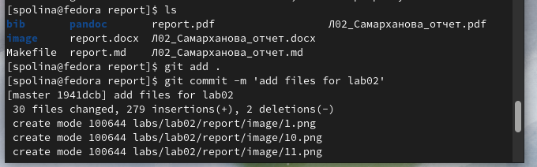
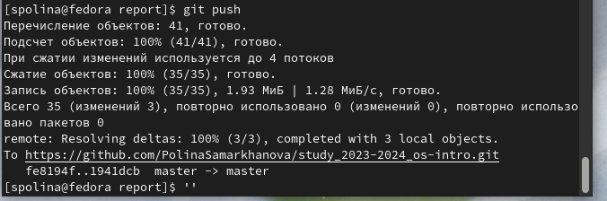

---
## Front matter
lang: ru-RU
title: Презентация лабораторной работы №3
subtitle: Операционные системы
author:
  - Самарханова П.Т.  НКАбд-05-23
institute:
  - Российский университет дружбы народов, Москва, Россия
date: 29 февраля 2024

## i18n babel
babel-lang: russian
babel-otherlangs: english

## Formatting pdf
toc: false
toc-title: Содержание
slide_level: 2
aspectratio: 169
section-titles: true
theme: metropolis
header-includes:
 - \metroset{progressbar=frametitle,sectionpage=progressbar,numbering=fraction}
 - '\makeatletter'
 - '\beamer@ignorenonframefalse'
 - '\makeatother'
---
## Цель работы

Цель данной лабораторной работы - научиться оформлять отчеты с помощью языка разметки Markdown

## Задание

1. Сделать отчет по предыдущей лабораторной работе в Markdown
2. В качестве отчета предоставить архив с файлами отчета в 3 форматах: pdf, docx и md

## Теоретическое введение

Markdown - облегченный язык разметки, созданный с целью обозначения форматирования в простом текстеб с максимальным сохранением его читаемости человеком, и пригодный для машинного преобразования в языки для продвинутых публикаций

# Выполнение лабораторной работы

## Выполнение лабораторной работы
Перехожу в каталог, в котором находится шаблон для отчета лабораторной работы, с помощью утилиты dc

## Выполнение лабораторной работы
Создаю копию шаблона, в которой буду работать, с помощью утилиты cp 

## Выполнение лабораторной работы
Открываю созданный файл в текстовом редакторе 

## Выполнение лабораторной работы
После изменения шаблона я выполнила его компиляцию в форматы docx и pdf 

## Выполнение лабораторной работы
Далее я отправила сгенерированные файлы на глобальный репозиторий 

## Выполнение лабораторной работы
Заключительная комана отправки файлов - команда git push 

## Выводы

При выполнении данной лабораторной работы я научилась оформлять отчеты с помощью легковесного языка разметки Markdown

## Список литературы

::: {#refs}
1. Лабораторная работа №3 URL:https://esystem.rudn.ru/pluginfile.php/2288079/mod_resource/content/3/003-lab_markdown.pdf
:::

# Спасибо за внимание

