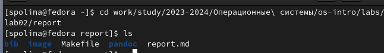
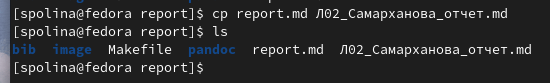
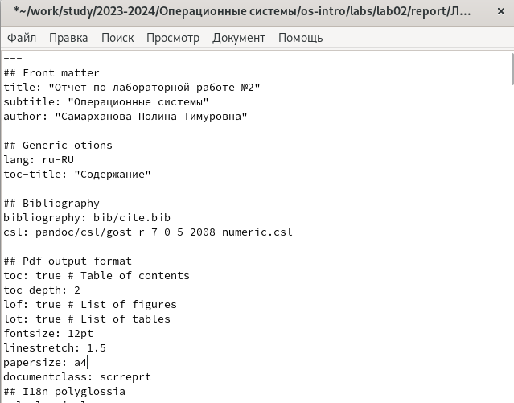
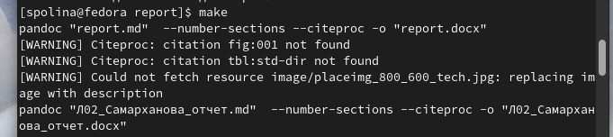
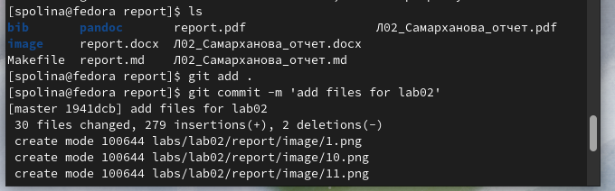
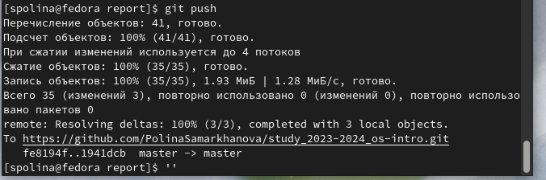

---
## Front matter
title: "Отчет по лабораторной раоте №3"
subtitle: "Операционные системы"
author: "Самарханова Полина Тимуровна"

## Generic otions
lang: ru-RU
toc-title: "Содержание"

## Bibliography
bibliography: bib/cite.bib
csl: pandoc/csl/gost-r-7-0-5-2008-numeric.csl

## Pdf output format
toc: true # Table of contents
toc-depth: 2
lof: true # List of figures
lot: true # List of tables
fontsize: 12pt
linestretch: 1.5
papersize: a4
documentclass: scrreprt
## I18n polyglossia
polyglossia-lang:
  name: russian
  options:
	- spelling=modern
	- babelshorthands=true
polyglossia-otherlangs:
  name: english
## I18n babel
babel-lang: russian
babel-otherlangs: english
## Fonts
mainfont: PT Serif
romanfont: PT Serif
sansfont: PT Sans
monofont: PT Mono
mainfontoptions: Ligatures=TeX
romanfontoptions: Ligatures=TeX
sansfontoptions: Ligatures=TeX,Scale=MatchLowercase
monofontoptions: Scale=MatchLowercase,Scale=0.9
## Biblatex
biblatex: true
biblio-style: "gost-numeric"
biblatexoptions:
  - parentracker=true
  - backend=biber
  - hyperref=auto
  - language=auto
  - autolang=other*
  - citestyle=gost-numeric
## Pandoc-crossref LaTeX customization
figureTitle: "Рис."
tableTitle: "Таблица"
listingTitle: "Листинг"
lofTitle: "Список иллюстраций"
lotTitle: "Список таблиц"
lolTitle: "Листинги"
## Misc options
indent: true
header-includes:
  - \usepackage{indentfirst}
  - \usepackage{float} # keep figures where there are in the text
  - \floatplacement{figure}{H} # keep figures where there are in the text
---

# Цель работы

Цель данной лабораторной работы - научиться оформлять отчеты с помощью языка разметки Markdown

# Задание

1. Сделать отчет по предыдущей лабораторной работе в Markdown
2. В качестве отчета предоставить архив с файлами отчета в 3 форматах: pdf, docx и md

# Теоретическое введение

Markdown - облегченный язык разметки, созданный с целью обозначения форматирования в простом текстеб с максимальным сохранением его читаемости человеком, и пригодный для машинного преобразования в языки для продвинутых публикаций

# Выполнение лабораторной работы

Описываются проведённые действия, в качестве иллюстрации даётся ссылка на иллюстрацию (рис.1).

{ #fig:001 width=70% }

Создаю копию шаблона, в которой буду работать, с помощью утилиты cp (рис.2).

{ #fig:002 width=70% }

Открываю созданный файл в текстовом редакторе (рис.3).

{ #fig:003 width=70% }

После изменения шаблона я выполнила его компиляцию в форматы docx и pdf (рис.4).

{ #fig:004 width=70% }

Далее я отправила сгенерированные файлы на глобальный репозиторий (рис.5).

{ #fig:005 width=70% }

Заключительная комана отправки файлов - команда git push (рис.6).

{ #fig:006 width=70% }

# Выводы

При выполнении данной лабораторной работы я научилась оформлять отчеты с помощью легковесного языка разметки Markdown

# Список литературы{.unnumbered}

::: {#refs}
1. Лабораторная работа №3 URL:https://esystem.rudn.ru/pluginfile.php/2288079/mod_resource/content/3/003-lab_markdown.pdf
:::
