---
## Front matter
lang: ru-RU
title: Выполнение индивидуального проекта
subtitle: Второй этап
author:
  - Самарханова Полина Тимуровна.
institute:
  - Российский университет дружбы народов, Москва, Россия
date: 16 марта 2024

## i18n babel
babel-lang: russian
babel-otherlangs: english

## Formatting pdf
toc: false
toc-title: Содержание
slide_level: 2
aspectratio: 169
section-titles: true
theme: metropolis
header-includes:
 - \metroset{progressbar=frametitle,sectionpage=progressbar,numbering=fraction}
 - '\makeatletter'
 - '\beamer@ignorenonframefalse'
 - '\makeatother'
---

## Докладчик

:::::::::::::: {.columns align=center}
::: {.column width="70%"}

  * Самарханова Полина Тимуровна
  * Студент
  * Российский университет дружбы народов
  * [1132236028@rudn.ru](mailto:1132236028@rudn.ru)

:::
::: {.column width="30%"}

:::
::::::::::::::

# Вводная часть

## Задания

Добавить к сайту данные о себе.

    Список добавляемых данных.
        Разместить фотографию владельца сайта.
        Разместить краткое описание владельца сайта (Biography).
        Добавить информацию об интересах (Interests).
        Добавить информацию от образовании (Education).
    Сделать пост по прошедшей неделе.
    Добавить пост на тему по выбору:
        Управление версиями. Git.
        Непрерывная интеграция и непрерывное развертывание (CI/CD).

## Цели и задачи

- Научиться добавлять данные на сайт hugo

# Выполнение проекта

##

Я начала с первого задания, установки своей фотографии, Для этого я перешла в папку admin и заменила данную фотографию на свою

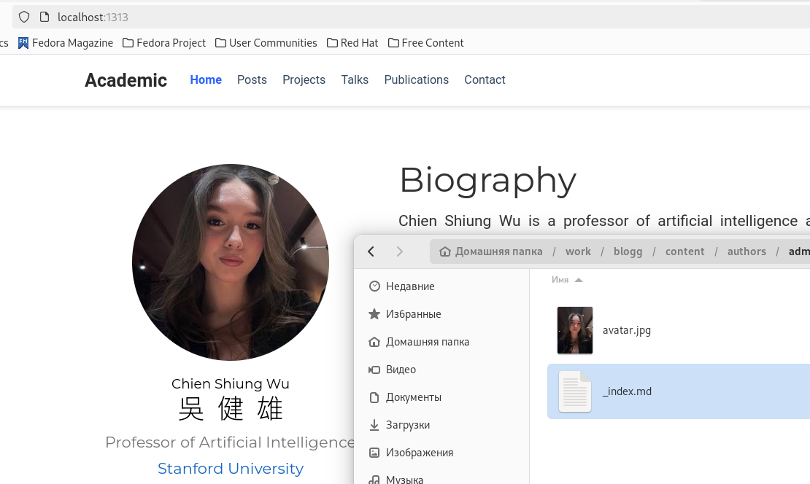

##

Далее я першла кизменению md файла. Написала свою биографию 

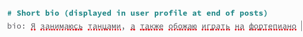

##

После чего, там же я изменила интересы на свои

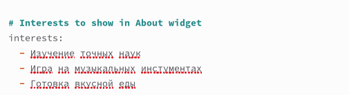

##

И заполнила свое образование

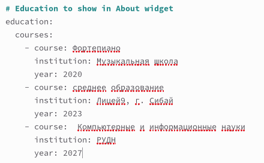

##

Далее я решила сменить имя и роль(в задании этого не прописано, но для красоты я сделала)

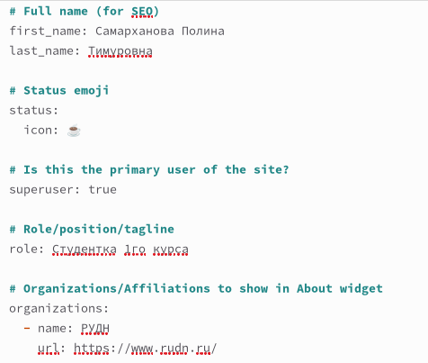

##

После чего я перешла к изменениям статей. Я замениоа данную статью на свою, а именно о прошедшей недели. Тем самым  выполняя задание

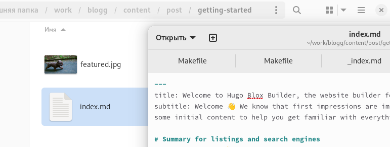

##

Показала, что статья на сайте заменилась

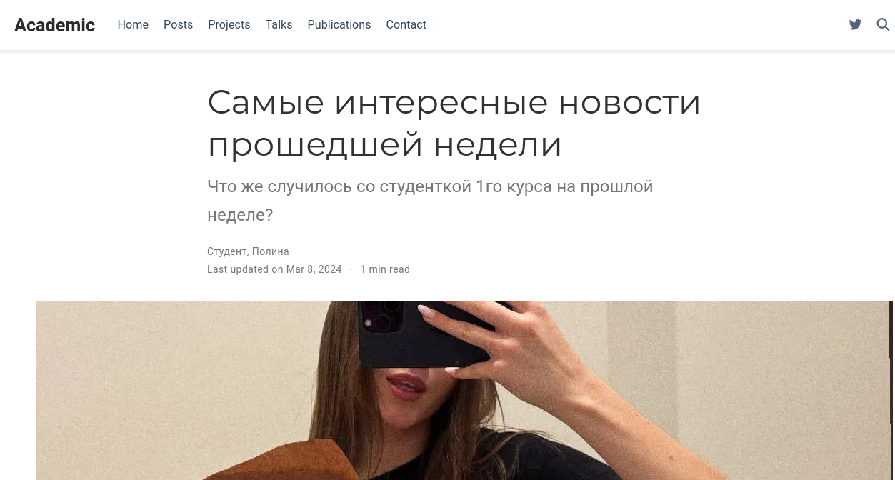

##

И показала, что на главной странице также все изменилось

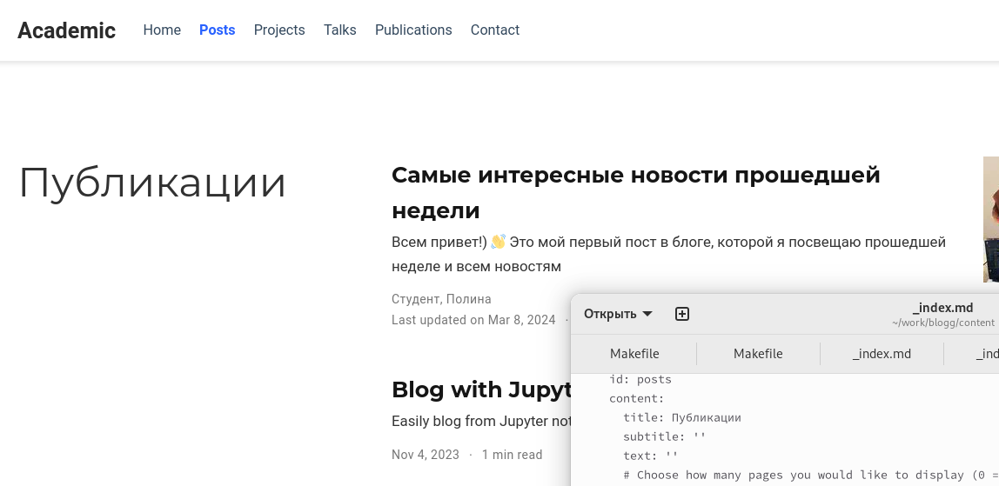

##

Далее перешла к следующему заданию, а именно написала вторую статью по теме на выбор( я взяла о git)

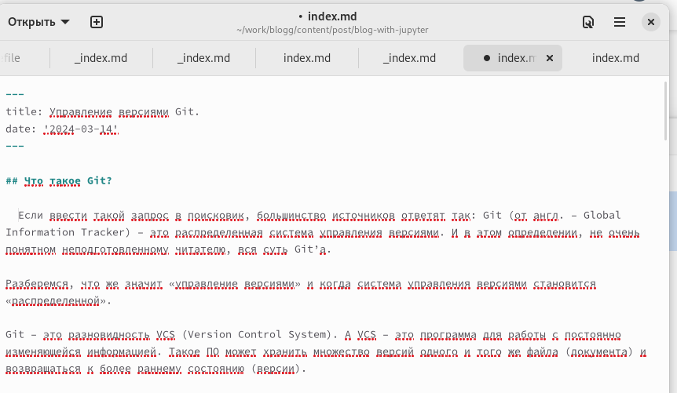

##

Показала, что обе статьи размещены на сайте 

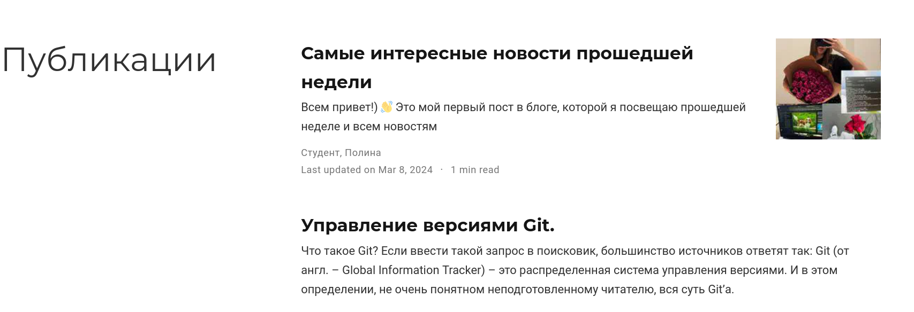

##

После чего, последним шагом я отправила все файлы на GitHub

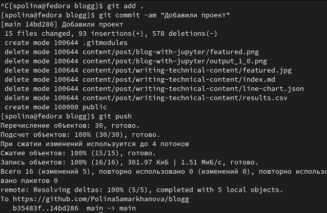

##

Спасибо за внимание!

