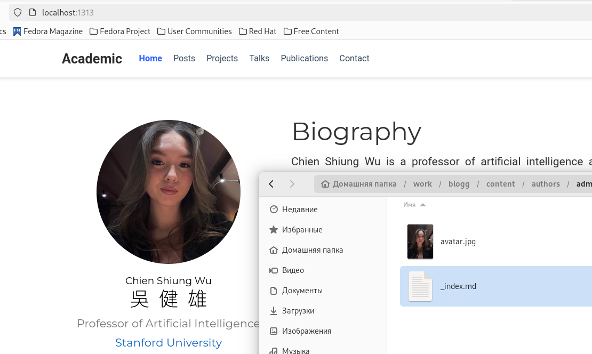
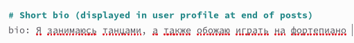
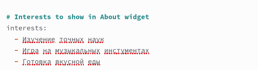
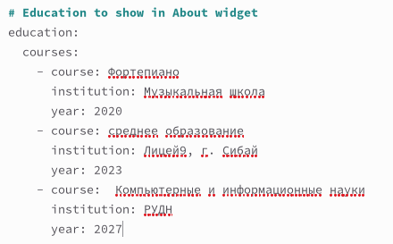
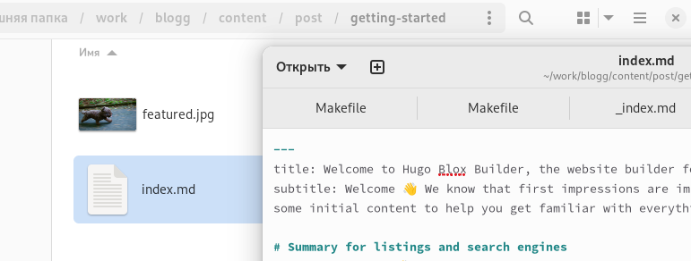
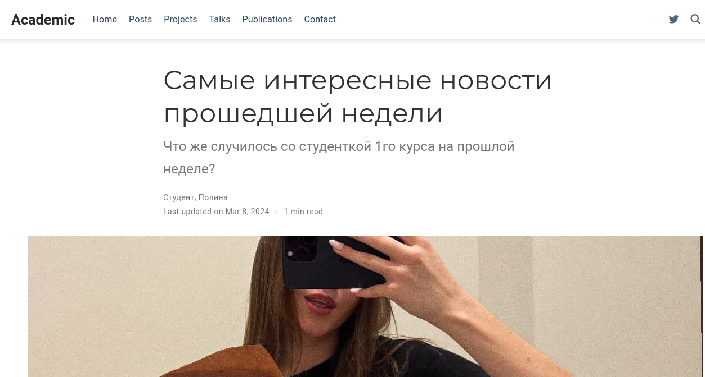
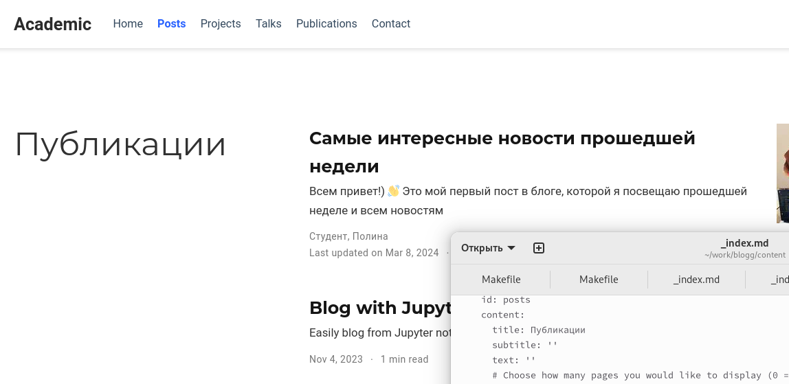
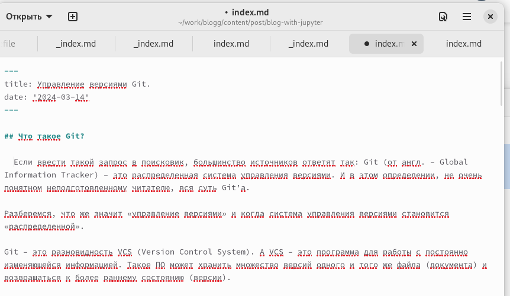
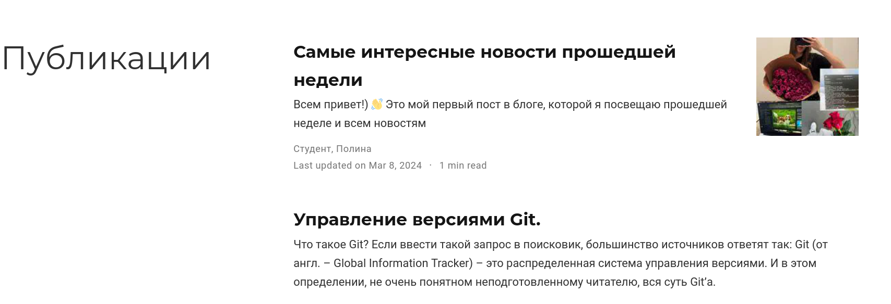
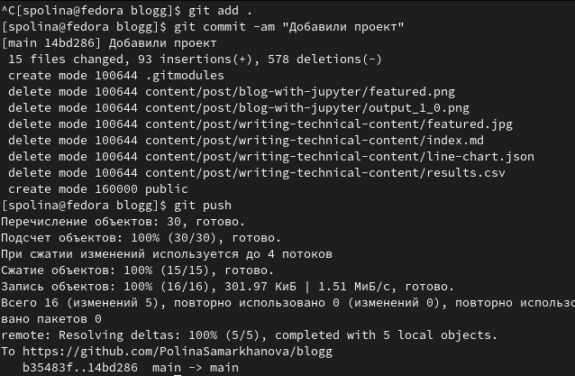

---
## Front matter
title: "Выполнение индивидуального проекта"
subtitle: "Этап второй"
author: "Самарханоа Полина Тимуровна"

## Generic otions
lang: ru-RU
toc-title: "Содержание"

## Bibliography
bibliography: bib/cite.bib
csl: pandoc/csl/gost-r-7-0-5-2008-numeric.csl

## Pdf output format
toc: true # Table of contents
toc-depth: 2
lof: true # List of figures
lot: true # List of tables
fontsize: 12pt
linestretch: 1.5
papersize: a4
documentclass: scrreprt
## I18n polyglossia
polyglossia-lang:
  name: russian
  options:
	- spelling=modern
	- babelshorthands=true
polyglossia-otherlangs:
  name: english
## I18n babel
babel-lang: russian
babel-otherlangs: english
## Fonts
mainfont: PT Serif
romanfont: PT Serif
sansfont: PT Sans
monofont: PT Mono
mainfontoptions: Ligatures=TeX
romanfontoptions: Ligatures=TeX
sansfontoptions: Ligatures=TeX,Scale=MatchLowercase
monofontoptions: Scale=MatchLowercase,Scale=0.9
## Biblatex
biblatex: true
biblio-style: "gost-numeric"
biblatexoptions:
  - parentracker=true
  - backend=biber
  - hyperref=auto
  - language=auto
  - autolang=other*
  - citestyle=gost-numeric
## Pandoc-crossref LaTeX customization
figureTitle: "Рис."
tableTitle: "Таблица"
listingTitle: "Листинг"
lofTitle: "Список иллюстраций"
lotTitle: "Список таблиц"
lolTitle: "Листинги"
## Misc options
indent: true
header-includes:
  - \usepackage{indentfirst}
  - \usepackage{float} # keep figures where there are in the text
  - \floatplacement{figure}{H} # keep figures where there are in the text
---

# Задание

Добавить к сайту данные о себе.

    Список добавляемых данных.
        Разместить фотографию владельца сайта.
        Разместить краткое описание владельца сайта (Biography).
        Добавить информацию об интересах (Interests).
        Добавить информацию от образовании (Education).
    Сделать пост по прошедшей неделе.
    Добавить пост на тему по выбору:
        Управление версиями. Git.
        Непрерывная интеграция и непрерывное развертывание (CI/CD).

# Выполнение второго этапа проекта

Я начала с первого задания, установки своей фотографии, Для этого я перешла в папку admin и заменила данную фотографию на свою

{#fig:001 width=70%}

Далее я першла кизменению md файла. Написала свою биографию 

{#fig:002 width=70%}

После чего, там же я изменила интересы на свои

{#fig:003 width=70%}

И заполнила свое образование

{#fig:004 width=70%}

Далее я решила сменить имя и роль(в задании этого не прописано, но для красоты я сделала)

{#fig:005 width=70%}

После чего я перешла к изменениям статей. Я замениоа данную статью на свою, а именно о прошедшей недели. Тем самым  выполняя задание

{#fig:006 width=70%}

Показала, что статья на сайте заменилась

{#fig:007 width=70%}

И показала, что на главной странице также все изменилось

{#fig:008 width=70%}

Далее перешла к следующему заданию, а именно написала вторую статью по теме на выбор( я взяла о git)

{#fig:009 width=70%}

Показала, что обе статьи размещены на сайте 

{#fig:010 width=70%}

После чего, последним шагом я отправила все файлы на GitHub

{#fig:011 width=70%}

Спасибо за внимание!

# Список литературы{.unnumbered}

::: {#refs}
:::
